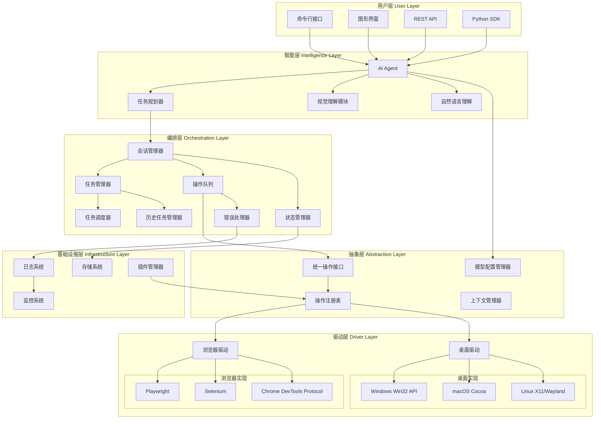

# 桌面与浏览器自动化框架 - 设计文档

## 概述

本框架采用分层架构设计，将智能决策、操作抽象、底层驱动分离，实现高内聚低耦合。核心设计理念：

1. **统一抽象**: 提供统一的操作接口，屏蔽底层差异
2. **智能驱动**: AI Agent理解任务意图，自动生成执行计划
3. **插件化**: 核心功能可通过插件扩展
4. **可观测**: 全链路追踪，便于调试和优化
5. **跨平台**: 支持Windows、macOS、Linux和多种浏览器

## 架构图



## 核心组件设计

### 1. AI Agent (智能代理)

**职责**: 理解用户意图，生成执行计划，监控执行过程

**核心功能**:
- 自然语言任务解析
- 视觉理解（按需调用，用于元素定位降级）
- 动态规划调整
- 错误恢复策略

**设计要点**:
```
Agent {
    - llm: LanguageModel (支持多种LLM后端)
    - vision_model: VisionModel (多模态理解，按需调用)
    - planner: TaskPlanner
    - memory: ConversationMemory
    - vision_fallback_enabled: bool (是否启用视觉降级)
    
    方法:
    + understand_task(task_description) -> TaskPlan
    + analyze_screenshot(image) -> UIState (按需调用)
    + locate_element_with_vision(screenshot, description) -> Coordinates (降级方案)
    + adapt_plan(current_state, error) -> UpdatedPlan
    + execute(task) -> ExecutionResult
}
```

**视觉模型调用时机**:
1. **元素定位失败**: 传统方法无法找到元素时
2. **元素不确定**: 多个匹配结果，需要视觉确认
3. **动态UI**: 页面结构频繁变化，传统定位不可靠
4. **验证操作**: 确认操作是否成功（如弹窗是否出现）
5. **用户明确要求**: 配置中启用"始终使用视觉识别"模式

### 2. 统一操作接口 (Unified Action Interface)

**职责**: 提供跨平台、跨驱动的统一操作抽象

**操作类型**:
```
Action (抽象基类)
├── NavigationAction (导航类)
│   ├── GoToURL
│   ├── GoBack
│   ├── GoForward
│   └── Refresh
├── InteractionAction (交互类)
│   ├── Click
│   ├── DoubleClick
│   ├── RightClick
│   ├── Hover
│   └── Drag
├── InputAction (输入类)
│   ├── Type
│   ├── Press
│   ├── PressCombo
│   └── Upload
├── QueryAction (查询类)
│   ├── GetText
│   ├── GetAttribute
│   ├── Screenshot
│   └── GetUITree
└── WaitAction (等待类)
    ├── WaitForElement
    ├── WaitForText
    └── WaitForCondition
```

**设计模式**: 命令模式 + 策略模式

```
UnifiedAction {
    - action_type: ActionType
    - target: Target (元素定位信息)
    - parameters: Dict
    - metadata: ActionMetadata
    
    方法:
    + validate() -> bool
    + execute(driver) -> ActionResult
    + rollback() -> bool
    + to_dict() -> Dict
}
```

### 3. 浏览器驱动 (Browser Driver)

**职责**: 封装浏览器自动化的底层实现

**多引擎支持**:
- **Playwright**: 推荐，现代化API，跨浏览器支持好
- **Selenium**: 兼容性好，生态成熟
- **CDP**: 直接使用Chrome DevTools Protocol，性能最优

**核心能力**:
```
BrowserDriver {
    - engine: BrowserEngine (Playwright/Selenium/CDP)
    - browser: Browser
    - context: BrowserContext
    - pages: List[Page]
    
    方法:
    + launch(browser_type, options) -> Browser
    + new_context(options) -> BrowserContext
    + new_page() -> Page
    + execute_action(action) -> ActionResult
    + get_dom_tree() -> DOMTree
    + inject_script(script) -> Any
    + intercept_network(pattern, handler)
}
```

**智能元素定位策略**:
1. **CSS Selector**: 快速精确（优先使用）
2. **XPath**: 复杂结构定位（次选）
3. **Text Content**: 基于文本内容（备选）
4. **Accessibility**: 使用ARIA属性（备选）
5. **Fuzzy Matching**: 模糊匹配（备选）
6. **AI Vision**: 视觉识别（最后降级方案，按需调用）

**元素定位降级流程**:
```
尝试定位元素:
1. 首先使用传统方法（CSS/XPath/Text/Accessibility）
2. 如果传统方法失败或元素不确定
3. 触发视觉模型分析
   - 截取当前页面/窗口截图
   - 调用Vision Model识别元素位置
   - 返回元素坐标或更新定位策略
4. 使用视觉识别结果执行操作

优势：
- 性能优化：大部分情况使用快速的传统方法
- 成本控制：只在必要时调用AI模型（减少API调用）
- 可靠性：当传统方法失效时提供智能降级
- 适应性：处理动态UI、复杂布局、无明确标识的元素
```

### 4. 桌面驱动 (Desktop Driver)

**职责**: 封装原生桌面应用自动化

**平台适配**:
```
DesktopDriver (抽象)
├── WindowsDriver
│   └── 使用 Win32 API, UIAutomation
├── MacOSDriver
│   └── 使用 Cocoa, Accessibility API
└── LinuxDriver
    └── 使用 X11, AT-SPI
```

**核心能力**:
```
DesktopDriver {
    - platform: Platform
    - ui_automation: UIAutomationClient
    - window_manager: WindowManager
    
    方法:
    + launch_app(app_name) -> Process
    + get_ui_tree(pid) -> UITree
    + find_element(locator) -> Element
    + find_element_with_vision(screenshot) -> Element
    + execute_action(action) -> ActionResult
    + capture_screen(region) -> Image
    + get_active_window() -> Window
}
```

**桌面元素定位降级策略**:
```
尝试定位桌面元素:
1. 首先使用平台原生API（UIAutomation/Accessibility）
   - Windows: UIAutomation (AutomationId, Name, ClassName)
   - macOS: Accessibility API (AXIdentifier, AXTitle)
   - Linux: AT-SPI (role, name, description)

2. 如果原生API失败或元素不确定
   - 获取UI树结构
   - 尝试基于属性匹配（模糊匹配）

3. 如果仍然失败，触发视觉模型
   - 截取桌面/窗口截图
   - 调用Vision Model识别元素
   - 返回元素坐标
   - 使用坐标执行点击/输入操作

优势：
- 性能：优先使用快速的原生API
- 成本：按需调用AI模型
- 兼容性：处理无障碍API不支持的应用
- 灵活性：适应各种桌面应用（包括游戏、自定义控件）
```

**UI树结构**:
```
UIElement {
    - id: str
    - type: ElementType (button, input, window, etc.)
    - bounds: Rectangle
    - properties: Dict (title, value, state, etc.)
    - children: List[UIElement]
    - parent: UIElement
    
    方法:
    + click()
    + type(text)
    + get_property(name)
    + wait_for_state(state, timeout)
}
```

### 5. 会话管理器 (Session Manager)

**职责**: 管理自动化任务的生命周期

**会话状态机**:
```
Session States:
CREATED → SCHEDULED → RUNNING → PAUSED → RESUMED → COMPLETED
                          ↓                           ↓
                        ERROR → RECOVERING → RUNNING  SAVED
                          ↓
                      TERMINATED/FAILED
```

**会话数据结构**:
```
Session {
    - id: UUID
    - task: Task
    - state: SessionState
    - context: ExecutionContext
    - history: List[ActionRecord]
    - checkpoints: List[Checkpoint]
    - schedule: Optional[Schedule]
    - created_at: DateTime
    - updated_at: DateTime
    - started_at: Optional[DateTime]
    - completed_at: Optional[DateTime]
    
    方法:
    + start()
    + pause()
    + resume()
    + stop()
    + terminate()
    + save()
    + delete()
    + save_checkpoint()
    + restore_checkpoint(checkpoint_id)
    + get_history() -> List[ActionRecord]
}
```

### 8. 任务管理器 (Task Manager)

**职责**: 管理任务的完整生命周期，包括定时、保存、删除等

**核心功能**:
```
TaskManager {
    - scheduler: TaskScheduler
    - storage: TaskStorage
    - executor: TaskExecutor
    - history: TaskHistory
    
    方法:
    + create_task(definition) -> Task
    + save_task(task) -> bool
    + delete_task(task_id) -> bool
    + schedule_task(task_id, schedule) -> bool
    + pause_task(task_id) -> bool
    + resume_task(task_id) -> bool
    + terminate_task(task_id) -> bool
    + get_task(task_id) -> Task
    + list_tasks(filter) -> List[Task]
    + get_task_status(task_id) -> TaskStatus
}
```

**任务定义**:
```
Task {
    - id: UUID
    - name: str
    - description: str
    - type: TaskType (BROWSER/DESKTOP/HYBRID)
    - definition: TaskDefinition (自然语言或结构化定义)
    - schedule: Optional[Schedule]
    - config: TaskConfig
    - created_by: str
    - created_at: DateTime
    - updated_at: DateTime
    - tags: List[str]
}
```

**定时调度**:
```
Schedule {
    - type: ScheduleType (ONCE, RECURRING, CRON)
    - start_time: DateTime
    - end_time: Optional[DateTime]
    - cron_expression: Optional[str]
    - timezone: str
    - enabled: bool
}
```

### 9. 历史任务管理器 (Task History Manager)

**职责**: 管理任务执行历史，支持查询和重新执行

**核心功能**:
```
TaskHistoryManager {
    - storage: HistoryStorage
    - analytics: TaskAnalytics
    
    方法:
    + record_execution(session) -> ExecutionRecord
    + get_history(filter) -> List[ExecutionRecord]
    + get_execution_details(execution_id) -> ExecutionRecord
    + replay_task(execution_id, params) -> Session
    + export_history(format, filter) -> File
    + get_statistics(task_id) -> TaskStatistics
    + cleanup_old_history(retention_policy)
}
```

**执行记录**:
```
ExecutionRecord {
    - id: UUID
    - task_id: UUID
    - session_id: UUID
    - status: ExecutionStatus
    - started_at: DateTime
    - completed_at: DateTime
    - duration: float
    - actions_count: int
    - success_rate: float
    - error_summary: Optional[str]
    - screenshots: List[str]
    - logs: str
    - metadata: Dict
}
```

### 10. 模型配置管理器 (Model Configuration Manager)

**职责**: 管理AI模型配置，支持动态切换

**核心功能**:
```
ModelConfigManager {
    - profiles: Dict[str, ModelProfile]
    - current_profile: str
    - fallback_chain: List[str]
    
    方法:
    + register_profile(profile) -> bool
    + set_active_profile(profile_name) -> bool
    + get_active_profile() -> ModelProfile
    + validate_profile(profile) -> ValidationResult
    + get_model_metrics(profile_name) -> ModelMetrics
    + configure_fallback(chain) -> bool
}
```

**模型配置**:
```
ModelProfile {
    - name: str
    - description: str
    - task_parser: ModelConfig
    - vision_model: ModelConfig
    - enabled: bool
    - priority: int
    - cost_limit: Optional[float]
    - performance_target: PerformanceTarget
}

ModelConfig {
    - provider: str (openai, anthropic, local, etc.)
    - model_name: str
    - api_key: Optional[str]
    - endpoint: Optional[str]
    - parameters: Dict (temperature, max_tokens, etc.)
    - timeout: float
    - retry_policy: RetryPolicy
}

PerformanceTarget {
    - max_latency: float
    - min_accuracy: float
    - max_cost_per_task: float
}
```
```

### 6. 上下文管理器 (Context Manager)

**职责**: 维护执行上下文和状态

**上下文内容**:
```
ExecutionContext {
    - session_id: UUID
    - current_driver: Driver (browser/desktop)
    - current_page: Page (for browser)
    - current_window: Window (for desktop)
    - variables: Dict (用户定义的变量)
    - screenshots: List[Screenshot]
    - dom_snapshots: List[DOMSnapshot]
    - ui_trees: List[UITree]
    - memory: ShortTermMemory
    
    方法:
    + set_variable(key, value)
    + get_variable(key) -> Any
    + capture_state() -> StateSnapshot
    + restore_state(snapshot)
}
```

### 7. 插件系统 (Plugin System)

**职责**: 提供扩展机制

**插件类型**:
```
Plugin (抽象基类)
├── ActionPlugin (操作插件)
│   └── 添加自定义操作
├── DriverPlugin (驱动插件)
│   └── 添加新的驱动实现
├── AgentPlugin (代理插件)
│   └── 扩展AI能力
└── IntegrationPlugin (集成插件)
    └── 集成第三方服务
```

**插件接口**:
```
Plugin {
    - name: str
    - version: str
    - dependencies: List[str]
    
    方法:
    + initialize(framework) -> bool
    + register() -> PluginManifest
    + execute(context, params) -> Result
    + cleanup()
}
```

## 插件系统详细设计

### 插件规范

**1. 插件清单 (plugin.yaml)**:
```yaml
name: "example-plugin"
version: "1.0.0"
author: "Your Name"
description: "插件描述"
type: "action"  # action, driver, agent, integration
homepage: "https://github.com/user/plugin"
license: "MIT"

# 依赖
dependencies:
  framework_version: ">=1.0.0"
  python_version: ">=3.8"
  packages:
    - requests>=2.28.0
    - beautifulsoup4>=4.11.0

# 权限声明
permissions:
  - network_access
  - file_system_read
  - file_system_write
  - execute_commands

# 配置项
config_schema:
  api_key:
    type: string
    required: true
    description: "API密钥"
  timeout:
    type: integer
    default: 30
    description: "超时时间（秒）"

# 入口点
entry_point: "main.ExamplePlugin"
```

**2. 插件目录结构**:
```
my-plugin/
├── plugin.yaml          # 插件清单
├── main.py             # 插件主文件
├── __init__.py
├── actions/            # 自定义操作（可选）
│   ├── __init__.py
│   └── custom_action.py
├── tests/              # 测试（可选）
│   └── test_plugin.py
├── README.md           # 文档
└── requirements.txt    # Python依赖
```

**3. 插件基类**:
```python
from abc import ABC, abstractmethod
from typing import Dict, Any, Optional

class Plugin(ABC):
    """插件基类"""
    
    def __init__(self, config: Dict[str, Any]):
        self.config = config
        self.framework = None
        self.logger = None
    
    @abstractmethod
    def initialize(self, framework) -> bool:
        """
        初始化插件
        
        Args:
            framework: 框架实例
            
        Returns:
            bool: 初始化是否成功
        """
        pass
    
    @abstractmethod
    def register(self) -> Dict[str, Any]:
        """
        注册插件功能
        
        Returns:
            Dict: 插件清单
        """
        pass
    
    @abstractmethod
    def execute(self, context: Dict[str, Any], params: Dict[str, Any]) -> Any:
        """
        执行插件功能
        
        Args:
            context: 执行上下文
            params: 参数
            
        Returns:
            Any: 执行结果
        """
        pass
    
    def cleanup(self):
        """清理资源"""
        pass
    
    def validate_config(self) -> bool:
        """验证配置"""
        return True
```

### 插件类型详细说明

**1. ActionPlugin (操作插件)**:
```python
from framework.plugin import Plugin
from framework.actions import Action

class CustomActionPlugin(Plugin):
    """自定义操作插件示例"""
    
    def register(self) -> Dict[str, Any]:
        return {
            "actions": [
                {
                    "name": "send_email",
                    "description": "发送邮件",
                    "parameters": {
                        "to": {"type": "string", "required": True},
                        "subject": {"type": "string", "required": True},
                        "body": {"type": "string", "required": True}
                    },
                    "handler": self.send_email
                }
            ]
        }
    
    def send_email(self, context, params):
        """发送邮件的具体实现"""
        # 实现邮件发送逻辑
        pass
```

**2. DriverPlugin (驱动插件)**:
```python
from framework.plugin import Plugin
from framework.drivers import Driver

class MobileDriverPlugin(Plugin):
    """移动端驱动插件示例"""
    
    def register(self) -> Dict[str, Any]:
        return {
            "drivers": [
                {
                    "name": "android",
                    "description": "Android设备驱动",
                    "class": AndroidDriver,
                    "supported_platforms": ["android"]
                },
                {
                    "name": "ios",
                    "description": "iOS设备驱动",
                    "class": IOSDriver,
                    "supported_platforms": ["ios"]
                }
            ]
        }
```

**3. AgentPlugin (代理插件)**:
```python
from framework.plugin import Plugin

class CustomAgentPlugin(Plugin):
    """AI代理增强插件示例"""
    
    def register(self) -> Dict[str, Any]:
        return {
            "agent_capabilities": [
                {
                    "name": "ocr",
                    "description": "OCR文字识别",
                    "handler": self.perform_ocr
                },
                {
                    "name": "translate",
                    "description": "文本翻译",
                    "handler": self.translate_text
                }
            ]
        }
    
    def perform_ocr(self, context, image):
        """OCR识别实现"""
        pass
    
    def translate_text(self, context, text, target_lang):
        """翻译实现"""
        pass
```

**4. IntegrationPlugin (集成插件)**:
```python
from framework.plugin import Plugin

class SlackIntegrationPlugin(Plugin):
    """Slack集成插件示例"""
    
    def register(self) -> Dict[str, Any]:
        return {
            "integrations": [
                {
                    "name": "slack_notify",
                    "description": "发送Slack通知",
                    "handler": self.send_notification
                }
            ],
            "hooks": [
                {
                    "event": "task_completed",
                    "handler": self.on_task_completed
                },
                {
                    "event": "task_failed",
                    "handler": self.on_task_failed
                }
            ]
        }
    
    def send_notification(self, context, message):
        """发送Slack通知"""
        pass
    
    def on_task_completed(self, context, task):
        """任务完成钩子"""
        pass
```

### 插件生命周期

```
插件生命周期:
1. 发现 (Discovery)
   - 扫描插件目录
   - 读取plugin.yaml
   - 验证插件格式

2. 加载 (Loading)
   - 检查依赖
   - 验证权限
   - 加载插件代码

3. 初始化 (Initialization)
   - 调用initialize()
   - 传入框架实例
   - 设置日志记录器

4. 注册 (Registration)
   - 调用register()
   - 注册功能到框架
   - 建立钩子连接

5. 执行 (Execution)
   - 响应框架调用
   - 执行插件功能
   - 返回结果

6. 清理 (Cleanup)
   - 调用cleanup()
   - 释放资源
   - 断开连接
```

### 插件管理器

```python
class PluginManager:
    """插件管理器"""
    
    def __init__(self, framework):
        self.framework = framework
        self.plugins = {}
        self.plugin_dirs = []
    
    def discover_plugins(self, directory: str):
        """发现插件"""
        pass
    
    def load_plugin(self, plugin_path: str) -> Plugin:
        """加载插件"""
        pass
    
    def enable_plugin(self, plugin_name: str) -> bool:
        """启用插件"""
        pass
    
    def disable_plugin(self, plugin_name: str) -> bool:
        """禁用插件"""
        pass
    
    def get_plugin(self, plugin_name: str) -> Optional[Plugin]:
        """获取插件实例"""
        pass
    
    def list_plugins(self) -> List[Dict[str, Any]]:
        """列出所有插件"""
        pass
    
    def validate_plugin(self, plugin: Plugin) -> bool:
        """验证插件"""
        pass
```

### 插件安全机制

**1. 权限控制**:
```python
PLUGIN_PERMISSIONS = {
    "network_access": "访问网络",
    "file_system_read": "读取文件系统",
    "file_system_write": "写入文件系统",
    "execute_commands": "执行系统命令",
    "access_credentials": "访问凭证",
    "modify_framework": "修改框架配置"
}
```

**2. 沙箱隔离**:
- 插件运行在独立的进程/线程中
- 限制资源使用（CPU、内存、网络）
- 超时控制
- 异常隔离（插件崩溃不影响框架）

**3. 签名验证**:
- 插件数字签名
- 来源验证
- 完整性检查

### 插件配置

**框架配置 (config.yaml)**:
```yaml
plugins:
  enabled: true
  directories:
    - ./plugins
    - ~/.automation-framework/plugins
  
  auto_load: true
  
  security:
    require_signature: false
    sandbox_enabled: true
    max_memory_mb: 512
    max_cpu_percent: 50
    network_timeout: 30
  
  installed:
    - name: "slack-integration"
      enabled: true
      config:
        webhook_url: "https://hooks.slack.com/..."
    
    - name: "email-action"
      enabled: true
      config:
        smtp_server: "smtp.gmail.com"
        smtp_port: 587
```

### 插件开发示例

**完整的插件示例 (main.py)**:
```python
from framework.plugin import Plugin
from typing import Dict, Any

class WeatherPlugin(Plugin):
    """天气查询插件"""
    
    def initialize(self, framework) -> bool:
        self.framework = framework
        self.logger = framework.get_logger(self.__class__.__name__)
        self.api_key = self.config.get("api_key")
        
        if not self.api_key:
            self.logger.error("API key not configured")
            return False
        
        self.logger.info("Weather plugin initialized")
        return True
    
    def register(self) -> Dict[str, Any]:
        return {
            "actions": [
                {
                    "name": "get_weather",
                    "description": "获取天气信息",
                    "parameters": {
                        "city": {"type": "string", "required": True}
                    },
                    "handler": self.get_weather
                }
            ]
        }
    
    def execute(self, context: Dict[str, Any], params: Dict[str, Any]) -> Any:
        action = params.get("action")
        if action == "get_weather":
            return self.get_weather(context, params)
        return None
    
    def get_weather(self, context, params):
        """获取天气信息"""
        city = params.get("city")
        # 调用天气API
        # ...
        return {
            "city": city,
            "temperature": 25,
            "condition": "晴天"
        }
    
    def cleanup(self):
        self.logger.info("Weather plugin cleanup")
```

## 数据模型

### 操作记录 (Action Record)
```
ActionRecord {
    - id: UUID
    - session_id: UUID
    - action: Action
    - timestamp: DateTime
    - duration: float
    - result: ActionResult
    - screenshot_before: Image
    - screenshot_after: Image
    - error: Optional[Error]
}
```

### 执行结果 (Action Result)
```
ActionResult {
    - success: bool
    - data: Any (返回数据)
    - error: Optional[Error]
    - metadata: Dict
    - performance: PerformanceMetrics
}
```

### 任务计划 (Task Plan)
```
TaskPlan {
    - task_id: UUID
    - description: str
    - steps: List[PlanStep]
    - estimated_duration: float
    - dependencies: List[str]
}

PlanStep {
    - step_id: int
    - action: Action
    - description: str
    - expected_outcome: str
    - fallback_actions: List[Action]
}
```

### 任务状态 (Task Status)
```
TaskStatus {
    - task_id: UUID
    - state: TaskState (CREATED, SCHEDULED, RUNNING, PAUSED, COMPLETED, FAILED, TERMINATED)
    - progress: float (0.0 - 1.0)
    - current_step: Optional[int]
    - total_steps: int
    - started_at: Optional[DateTime]
    - estimated_completion: Optional[DateTime]
    - error: Optional[Error]
}
```

### 任务统计 (Task Statistics)
```
TaskStatistics {
    - task_id: UUID
    - total_executions: int
    - successful_executions: int
    - failed_executions: int
    - success_rate: float
    - average_duration: float
    - total_duration: float
    - last_execution: DateTime
    - error_distribution: Dict[str, int]
    - performance_trend: List[PerformancePoint]
}
```

### 模型性能指标 (Model Metrics)
```
ModelMetrics {
    - profile_name: str
    - total_requests: int
    - successful_requests: int
    - failed_requests: int
    - average_latency: float
    - p95_latency: float
    - p99_latency: float
    - total_cost: float
    - average_cost_per_request: float
    - accuracy_score: Optional[float]
    - last_updated: DateTime
}
```

## 关键技术决策

### 1. 浏览器自动化技术选型

**推荐: Playwright**

理由:
- 现代化API设计，异步支持好
- 跨浏览器支持（Chromium, Firefox, WebKit）
- 自动等待机制，减少flaky tests
- 网络拦截、模拟功能强大
- 活跃维护，微软支持

备选方案:
- Selenium: 生态成熟，但API较老
- CDP: 性能最优，但只支持Chrome系

### 2. AI模型集成

**多模型支持策略**:
```
LLM Backend:
- OpenAI GPT-4/GPT-4V (商业，效果最好)
- Anthropic Claude (商业，推理能力强)
- Google Gemini (商业，多模态)
- Local Models (开源，隐私保护)
  - Llama 3
  - Qwen-VL
  - Ollama

Vision Model:
- GPT-4V (多模态)
- Claude 3 (多模态)
- Qwen-VL (开源)
- CLIP (开源，轻量)
```

### 3. 跨平台UI自动化

**技术栈**:
- **Windows**: pywinauto + UIAutomation
- **macOS**: pyobjc + Accessibility API
- **Linux**: python-xlib + AT-SPI

**统一抽象层**: 封装平台差异，提供统一接口

### 4. 状态持久化

**存储方案**:
- **会话数据**: SQLite (轻量，嵌入式)
- **截图/日志**: 文件系统 (按会话组织)
- **配置**: YAML/JSON文件
- **缓存**: Redis (可选，用于分布式场景)

### 5. 并发模型

**核心原则：浏览器并发 + 桌面串行**

**异步架构**:
- 使用 asyncio 作为核心并发模型
- 浏览器操作天然异步（Playwright）
- 桌面操作通过线程池包装为异步

**并发策略**:

#### 浏览器任务并发 ✅
- **支持真正的并发执行**
- 每个会话使用独立的浏览器实例（独立进程）
- 完全隔离：独立的Cookie、缓存、会话状态
- 通过浏览器实例池管理资源
- 原理：Playwright通过DevTools Protocol控制浏览器，不使用物理鼠标

#### 桌面任务串行 ⚠️
- **必须串行执行，不能并发**
- 原因：物理限制（只有一个鼠标、一个键盘焦点）
- 使用互斥锁确保同一时间只有一个桌面任务执行
- 任务自动排队，按顺序执行
- 原理：pywinauto/pyautogui需要移动物理鼠标光标

**智能任务分类**:
```python
TaskType:
- BROWSER: 浏览器任务 → 可并发（最多N个）
- DESKTOP: 桌面任务 → 必须串行
- HYBRID: 混合任务 → 特殊处理
```

**执行示例**:
```
输入任务：
1. 打开浏览器搜索新闻 (BROWSER)
2. 登录Gmail (BROWSER)
3. 打开记事本 (DESKTOP)
4. 下载文件 (BROWSER)
5. 打开Excel (DESKTOP)

实际执行：
并发组: 任务1、2、4 同时执行 (3个浏览器实例)
串行组: 任务3 → 任务5 依次执行 (共享桌面)
```

**资源管理**:
- 浏览器实例池（可配置最大数量）
- 桌面操作互斥锁
- 连接池管理
- 内存限制和清理

### 6. 任务调度策略

**调度引擎**:
- 使用 APScheduler 或类似库
- 支持 Cron 表达式
- 支持一次性和周期性任务
- 支持任务优先级

**调度类型**:
```
1. 立即执行 (Immediate)
   - 任务创建后立即执行

2. 定时执行 (Scheduled)
   - 指定具体时间执行
   - 支持时区设置

3. 周期执行 (Recurring)
   - 每天/每周/每月执行
   - Cron 表达式支持

4. 条件触发 (Conditional)
   - 基于事件触发
   - 基于文件变化触发
   - 基于API回调触发
```

**调度策略**:
- 任务队列管理（FIFO, Priority）
- 并发限制（浏览器任务池大小）
- 失败重试策略
- 超时处理

### 7. 模型配置策略

**多模型支持**:
```
配置文件示例 (YAML):
model_profiles:
  fast:
    task_parser:
      provider: openai
      model: gpt-3.5-turbo
      temperature: 0.7
    vision_model:
      provider: openai
      model: gpt-4-vision-preview
      fallback_only: true  # 只在降级时使用
      max_calls_per_task: 5  # 每个任务最多调用5次
    
  accurate:
    task_parser:
      provider: anthropic
      model: claude-3-opus
      temperature: 0.3
    vision_model:
      provider: anthropic
      model: claude-3-opus
      fallback_only: true
      max_calls_per_task: 10
  
  local:
    task_parser:
      provider: ollama
      model: llama3
      endpoint: http://localhost:11434
    vision_model:
      provider: local
      model: qwen-vl
      endpoint: http://localhost:8000
      fallback_only: false  # 本地模型可以更频繁使用
      max_calls_per_task: -1  # 无限制

  vision_always:  # 始终使用视觉识别模式
    task_parser:
      provider: openai
      model: gpt-4-turbo
    vision_model:
      provider: openai
      model: gpt-4-vision-preview
      fallback_only: false  # 不仅用于降级
      max_calls_per_task: -1

  fallback_chain: [accurate, fast, local]
```

**视觉模型调用策略**:
- **fallback_only: true**: 只在传统方法失败时调用（推荐，节省成本）
- **fallback_only: false**: 可以主动使用视觉识别
- **max_calls_per_task**: 限制每个任务的视觉模型调用次数
- **cache_enabled**: 启用识别结果缓存
- **confidence_threshold**: 置信度阈值，低于此值触发重试

**动态切换**:
- 运行时切换模型配置
- 基于任务复杂度自动选择
- 基于成本/性能权衡
- 失败自动降级到备用模型

**模型监控**:
- 实时性能指标（延迟、成功率）
- 成本追踪
- 准确度评估
- 自动告警

## 错误处理策略

### 错误分类

```
Error Hierarchy:
├── RecoverableError (可恢复)
│   ├── TimeoutError
│   ├── ElementNotFoundError
│   ├── NetworkError
│   └── TemporaryError
├── UnrecoverableError (不可恢复)
│   ├── AuthenticationError
│   ├── PermissionError
│   └── ConfigurationError
└── SystemError (系统错误)
    ├── DriverCrashError
    ├── OutOfMemoryError
    └── PlatformError
```

### 恢复策略

```
Recovery Strategy:
1. Retry with exponential backoff
   - 初始延迟: 1s
   - 最大重试: 3次
   - 退避因子: 2

2. Fallback actions
   - 尝试备选定位策略
   - 使用视觉识别
   - 降级到手动模式

3. Checkpoint restore
   - 回滚到最近的检查点
   - 重新执行失败步骤

4. Human intervention
   - 暂停执行
   - 请求用户输入
   - 继续执行
```

## 性能优化

### 1. 截图优化
- 按需捕获，不是每步都截图
- 压缩存储（JPEG质量80%）
- 异步保存，不阻塞主流程

### 2. DOM/UI树优化
- 增量更新，不是每次全量
- 只保留可交互元素
- 压缩存储

### 3. 视觉模型调用优化
- **按需调用策略**: 只在传统方法失败时调用
- **缓存机制**: 相似截图复用识别结果
- **批量处理**: 多个元素识别合并为一次调用
- **超时控制**: 设置合理的API超时时间
- **成本监控**: 追踪API调用次数和成本
- **降级配置**: 允许用户禁用视觉识别以节省成本

### 4. 并发优化
- 浏览器实例复用
- 浏览器实例池管理（支持并发）
- 桌面操作互斥锁（防止冲突）
- 连接池管理
- 资源预加载

### 5. 内存优化
- 定期清理历史记录
- 限制截图数量
- 使用弱引用

## 安全考虑

### 1. 凭证管理
- 使用系统密钥链存储
- 环境变量注入
- 加密存储

### 2. 沙箱隔离
- 浏览器上下文隔离
- 进程级隔离
- 网络策略限制

### 3. 审计日志
- 记录所有敏感操作
- 不记录密码等敏感信息
- 支持日志导出

## 可观测性

### 1. 日志系统
```
Log Levels:
- DEBUG: 详细执行信息
- INFO: 关键步骤
- WARNING: 可恢复错误
- ERROR: 不可恢复错误
- CRITICAL: 系统级错误

Log Format:
[timestamp] [level] [session_id] [component] message
```

### 2. 监控指标
- 执行成功率
- 平均执行时间
- 错误率和类型分布
- 资源使用情况

### 3. 追踪
- 分布式追踪（OpenTelemetry）
- 操作链路追踪
- 性能分析

## 部署架构

### 单机模式
```
User → Framework → Drivers → OS/Browser
```

### 服务模式
```
Client → REST API → Framework Service → Drivers
                         ↓
                    Task Queue (Redis)
                         ↓
                    Worker Pool
```

### 分布式模式
```
Client → API Gateway → Load Balancer
                            ↓
                    Framework Cluster
                            ↓
                    Shared Storage (S3/NFS)
                            ↓
                    Database (PostgreSQL)
```

## 扩展性设计

### 1. 水平扩展
- 无状态设计
- 会话亲和性
- 共享存储

### 2. 垂直扩展
- 资源池管理
- 动态调整并发数
- 内存优化

### 3. 功能扩展
- 插件系统
- 自定义操作
- 集成第三方服务

## 下一步实现建议

### Phase 1: 核心框架 (2-3周)
1. 统一操作接口设计
2. 浏览器驱动实现（Playwright）
3. 基础会话管理
4. 简单的错误处理

### Phase 2: 智能层 (2-3周)
1. AI Agent集成
2. 视觉理解模块
3. 任务规划器
4. 自然语言解析
5. 模型配置管理器

### Phase 3: 任务管理 (2-3周)
1. 任务生命周期管理（保存、删除、暂停、终止）
2. 任务调度器（定时执行）
3. 历史任务管理
4. 任务统计和分析

### Phase 4: 桌面支持 (2-3周)
1. Windows驱动实现
2. macOS驱动实现
3. Linux驱动实现
4. 跨平台抽象

### Phase 5: 高级特性 (2-3周)
1. 插件系统
2. 状态持久化
3. 并发优化
4. 监控和日志

### Phase 6: 生态建设 (持续)
1. 文档和示例
2. 社区插件
3. 性能优化
4. 安全加固
